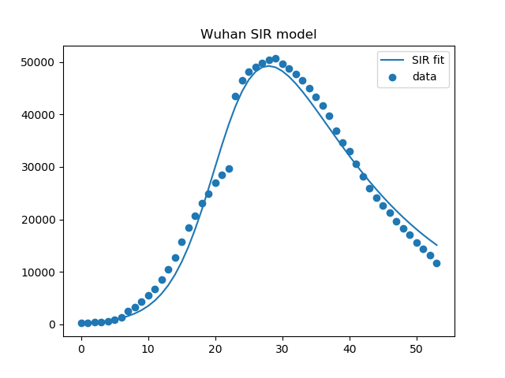
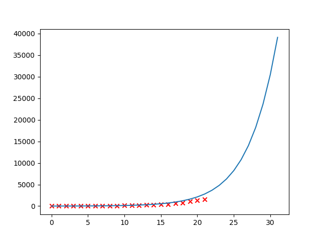

# covid-19-model
 The SIR model fitted to COVID-19 infected cases data from Wuhan. Apply parameters of SIR to UK for prediction.

## Wuhan model

`wuhan_SIR_model.py' fits parameters in SIR model: gamma and beta
- gamma: contact parameter = 1/R0
- beta: recovery rate = 1/days-required-to-recover
  
Current fitted parameter:

|gamma|beta|
|---|---|
|0.33838125|0.06476182|

|R0|recovery-day|
|---|---|
|2.9552465186097683|15.441196085990235|

Covariance matrix:
|pcov|gamma|beta|
|---|---|---|
|gamma|5.10117057e-06|4.55526000e-07|
|beta|4.55526000e-07|9.14512396e-07|

Last update: 15 Mar 2020

## UK prediction

Note: y axis is **log10** of infected cases.

Last update: 23 Mar 2020